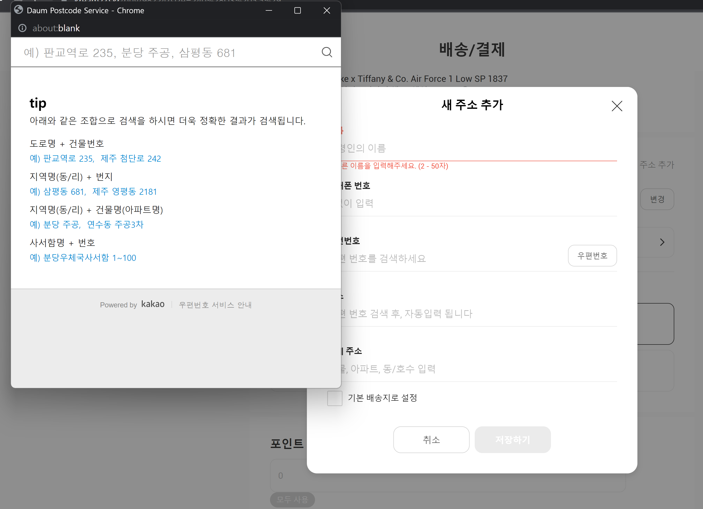
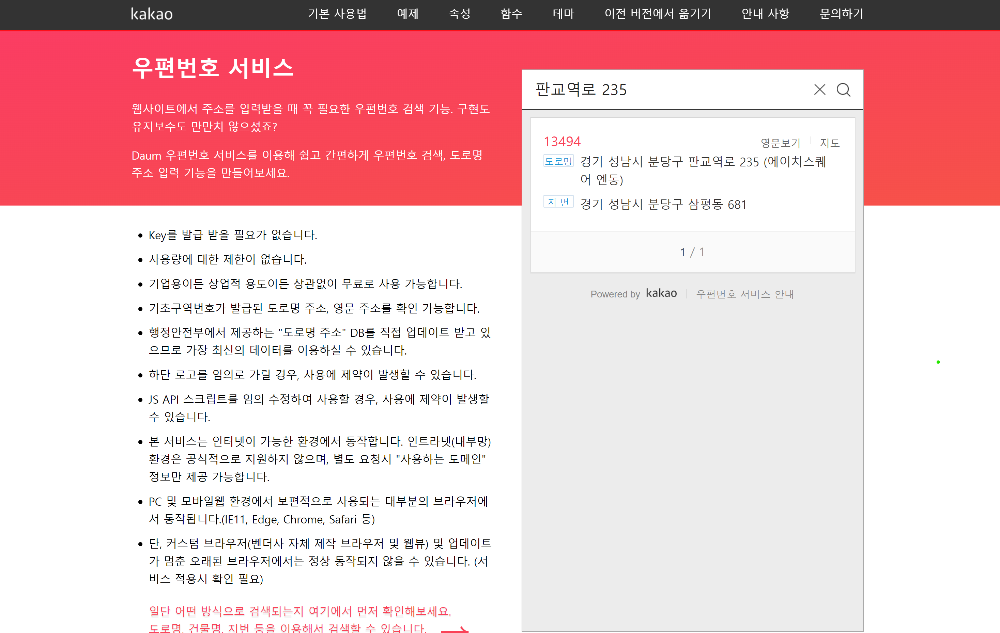

# Daum 주소 검색 API

---

# 문제 인식


* 4차 과제의 클론 타겟 사이트 [Kream](https://www.kream.co.kr) 결제 페이지 구현
* 배송 프로필 추가 시 주소 검색 기능 필요


---
# 왜 Daum 주소 검색 API를?
* API Key 발급 필요 없음
* 사용량에 제한이 없으며 용도에 관련없이 무료
* 예제 코드가 수정하기 편함
* 약간의 스타일 변경이 가능함
* 팝업과 iframe Embed 모두 지원

--- 
# 카카오 주소 검색은 안됨?
* API Key 발급 필요
* 필요한 기능이 주소 검색 하나뿐임
* 예제 코드가 없어서 분석 및 학습에 시간 필요

---
# 알아두면 좋은 부분
```js
new daum.Postcode({ 
  oncomplete: function (data) { /* 검색 결과 선택된 애가 data */ },
  onresize: function (size) { /* Embed 옵션 시 frame 크기 조절 */ },
  onclose: function (state) { /* oncomplete 함수 실행 이 후
                                창 닫히면 실행하고자 하는 코드 */ },
  onsearch: function (data) { /* data는 검색 결과에 대한 검색어(q)와 결과 갯수(count) */ },
  theme: { /* 테마 색상 변경 ex. bgColor: "#000" */ }, 
 })
 .open({
  popupTitle: '우편번호 검색 팝업창 이름', 
  autoClose: false // true 일 경우 검색 결과 선택 시 자동으로 창이 닫힘
 })
 .embed(targetFrame, {
   q: '검색어',
   autoClose: false // true 일 경우 검색 결과 선택 시 자동으로 display가 사라짐
 })
```

--- 
# 예제

- 예제 링크는 프리젠테이션 후 정리가 끝나면 노션에 공유

---
# [Daum 주소 검색 API 링크](https://postcode.map.daum.net/guide)

